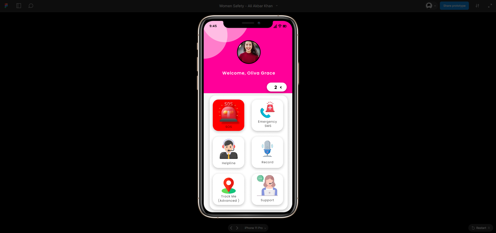
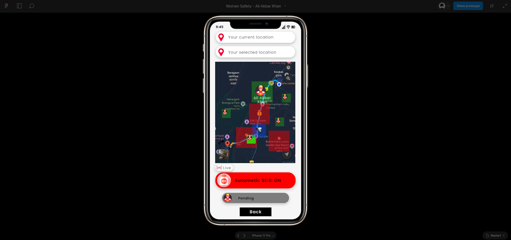
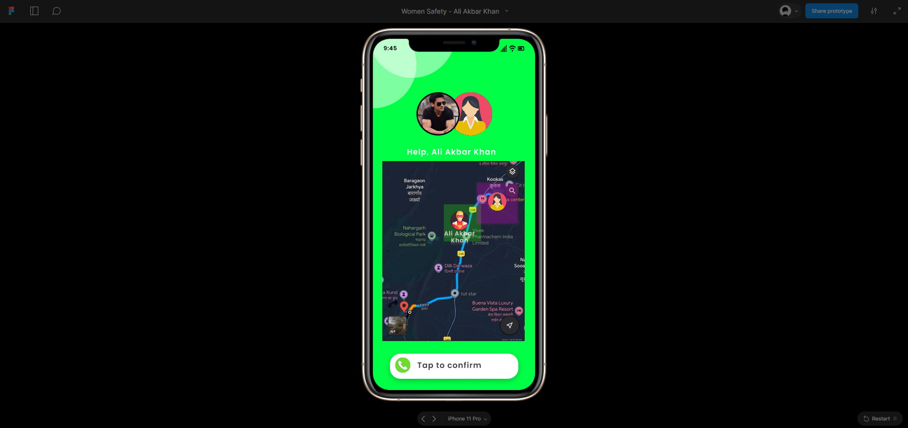

# Women Safety Application Prototype

## All Rights Reserved.
This repository and its contents are copyrighted. No part of this repository may be reproduced, distributed, or used without explicit permission from the owner.

## Overview 
This repository contains the Figma prototype for a **Women Safety Application**. The app is designed to provide quick access to safety features, including an SOS system, location sharing, and a volunteer network to help women in distress. The prototype focuses on ease of use, accessibility, and modern UX design.

## Features
- **SOS Button**: Instantly sends alerts to contacts with location information.
- **Location Tracking**: Shares the user’s real-time location with pre-selected contacts.
- **Volunteer Network**: Notifies nearby volunteers in case of emergency.
- **User-Friendly Design**: Focused on simplicity and efficiency.

## Prototype Preview 
You can view the prototype on Figma using [this link](https://www.figma.com/community/file/1427140082340890877/women-safety-ali-akbar-khan).

## Screenshots 
Here are some key screenshots of the prototype:

| Home Screen | SOS Button Screen | Volunteer Network Screen |
|:-----------:|:-----------------:|:------------------------:|
|  |  |  |

## Video 📸

https://github.com/user-attachments/assets/cfc3a503-f4d1-40cb-817a-6608aca95076

https://github.com/user-attachments/assets/a5503f72-a513-4d4d-9927-6884343ddde9

https://github.com/user-attachments/assets/04d3d674-2495-4990-ae6b-40e9ff5387c1

https://github.com/user-attachments/assets/01bfc068-f673-4061-bb11-6a30bc05080d

## Files in the Repository 
- **Prototype Files** (`.fig`): Figma project file showcasing the design.
- **Screenshots** (`.png`, `.jpg`): Key screen designs for quick reference.
- **Video Demos** (`.mp4`, `.gif`): Short videos showcasing how the app works.
- **Documentation** (`.pdf`): Detailed explanation of the app’s flow, wireframes, and design decisions.
  
## How to Use 
1. Download the `.fig` file or access the Figma prototype via the link provided.
2. Use Figma or Figma Mirror to explore the design on desktop or mobile.

## Future Plans 
- Add interactive elements to the prototype for a more dynamic demonstration.
- Integrate feedback from users to enhance UI/UX.

## Contributing 
If you’d like to contribute or provide suggestions, feel free to fork the repository and submit a pull request!

## License 

https://github.com/user-attachments/assets/1b6f530c-0eb8-4c25-90c6-f26a9c64263a

This license allows for downloading and sharing the content with attribution, but it does not allow for any modifications or commercial use.

For more details, please refer to [this link](https://creativecommons.org/licenses/by-nc-nd/4.0/legalcode).

